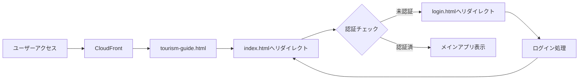

# Phase 7.1: Stripe審査対応 - パブリックアクセス可能なサイト構築

**実施日**: 2025年8月27日  
**目的**: Stripe審査通過のため、ログイン不要でアクセス可能なウェブサイトに改修  
**背景**: Stripeの審査要件として、ビジネス情報や利用規約が公開されたウェブサイトが必要

## 🎯 改修目標

### Stripe審査要件の充足
1. **パブリックアクセス**: ログイン不要でウェブサイトにアクセス可能
2. **ビジネス情報の表示**: 特定商取引法ページ、会社情報ページへのアクセス
3. **サービス説明**: ログインなしでサービス内容が理解できる
4. **料金プランの明示**: 課金プランと価格が明確に表示される

## 📊 現在の構成分析

### 現在の認証フロー


### 問題点
- CloudFrontのデフォルトルートが`tourism-guide.html`（レガシー）
- `index.html`は認証必須で、未認証時は`login.html`へ強制リダイレクト
- パブリックでアクセスできるのは`login.html`のみ
- サービス内容や料金プランがログイン前に確認できない

## 🔧 改修計画

### Phase 7.1.1: フロントエンド改修

#### 1. index.htmlの改修
```javascript
// 現在のコード（index.html）
window.addEventListener('load', async () => {
    const isAuthenticated = await checkAuthenticationStatus();
    if (isAuthenticated) {
        // メインアプリ表示
    } else {
        window.location.href = './login.html'; // ← この強制リダイレクトを削除
    }
});

// 改修後のコード
window.addEventListener('load', async () => {
    const isAuthenticated = await checkAuthenticationStatus();
    if (isAuthenticated) {
        // 認証済み：フル機能を有効化
        showAuthenticatedUI();
        enableAllFeatures();
    } else {
        // 未認証：公開モードで表示
        showPublicUI();
        showServiceDescription();
        disableProtectedFeatures();
    }
});
```

#### 2. 新規実装する関数

```javascript
// 公開UI表示関数
function showPublicUI() {
    // ヘッダーを公開モード用に変更
    document.getElementById('authLoading').style.display = 'none';
    document.getElementById('mainApp').style.display = 'block';
    
    // ログインボタンを表示
    const loginSection = document.createElement('div');
    loginSection.className = 'login-prompt-section';
    loginSection.innerHTML = `
        <div class="login-prompt">
            <h2>🏔️ 観光アナライザーへようこそ</h2>
            <p>AI画像解析で観光・グルメ情報を多言語で提供します</p>
            <button onclick="window.location.href='./login.html'" class="auth-btn-large">
                ログイン / 新規登録
            </button>
        </div>
    `;
    document.querySelector('.header').appendChild(loginSection);
    
    // ユーザー情報セクションを非表示
    document.getElementById('userInfo').style.display = 'none';
    document.getElementById('userPlan').style.display = 'none';
}

// サービス説明表示関数
function showServiceDescription() {
    const serviceSection = document.createElement('section');
    serviceSection.className = 'service-description';
    serviceSection.innerHTML = `
        <div class="service-intro">
            <h2>📸 サービスの特徴</h2>
            <div class="features-grid">
                <div class="feature-card">
                    <h3>🤖 AI画像解析</h3>
                    <p>最新のAI技術で観光地や料理を瞬時に識別</p>
                </div>
                <div class="feature-card">
                    <h3>🌐 多言語対応</h3>
                    <p>日本語・韓国語・中国語・英語に対応</p>
                </div>
                <div class="feature-card">
                    <h3>📍 地域特化</h3>
                    <p>札幌・北海道の観光情報に特化した精度の高い解析</p>
                </div>
            </div>
        </div>
        
        <div class="pricing-section">
            <h2>💳 料金プラン</h2>
            <div class="pricing-grid">
                <div class="price-card">
                    <h3>無料プラン</h3>
                    <p class="price">¥0</p>
                    <ul>
                        <li>月5回まで解析可能</li>
                        <li>基本機能すべて利用可</li>
                    </ul>
                </div>
                <div class="price-card featured">
                    <h3>7日間プラン</h3>
                    <p class="price">¥980</p>
                    <ul>
                        <li>7日間無制限解析</li>
                        <li>すべての機能が利用可能</li>
                    </ul>
                </div>
                <div class="price-card">
                    <h3>20日間プラン</h3>
                    <p class="price">¥1,980</p>
                    <ul>
                        <li>20日間無制限解析</li>
                        <li>長期利用でお得</li>
                    </ul>
                </div>
            </div>
        </div>
        
        <div class="demo-section">
            <h2>🎯 使い方デモ</h2>
            
            <p>画像をアップロードするだけで、観光地や料理の情報を即座に取得</p>
        </div>
    `;
    
    // メインアプリの前に挿入
    const mainApp = document.querySelector('.main-app');
    mainApp.parentNode.insertBefore(serviceSection, mainApp);
}

// 保護機能の無効化
function disableProtectedFeatures() {
    // 画像アップロード機能を無効化
    const uploadSection = document.getElementById('uploadSection');
    if (uploadSection) {
        uploadSection.style.opacity = '0.5';
        uploadSection.style.pointerEvents = 'none';
        uploadSection.innerHTML += `
            <div class="feature-overlay">
                <p>この機能を使用するにはアカウントが必要です</p>
                <button onclick="window.location.href='./login.html'">ログイン / 新規登録</button>
            </div>
        `;
    }
    
    // 解析ボタンを無効化
    const analyzeButton = document.getElementById('analyzeButton');
    if (analyzeButton) {
        analyzeButton.disabled = true;
        analyzeButton.textContent = 'アカウント作成して解析開始';
        analyzeButton.onclick = () => window.location.href = './login.html';
    }
}
```

#### 3. login.htmlでの選択機能（既存実装活用）

```javascript
// 既存のlogin.htmlには以下の機能が実装済み
// - Google認証ボタン
// - メール認証（ログイン/新規登録切り替え）
// - 緊急ログイン機能

// 追加作業は不要：
// login.html内のauth-mode-switcherで「ログイン」「新規登録」切り替え可能
// 既存のhandleCognitoLogin()とhandleCognitoSignup()が利用可能
```

#### 4. auth.jsの改修

```javascript
// 認証チェック関数の修正
async function checkAuthenticationStatus() {
    try {
        const tourismAuth = localStorage.getItem('tourismAuth');
        const accessToken = localStorage.getItem('accessToken');
        
        if (!tourismAuth || !accessToken) {
            // 認証情報なし → falseを返すが、リダイレクトはしない
            return false;
        }
        
        // 既存の認証検証ロジック
        const response = await fetch(API_URL + '/auth/user-info', {
            headers: { 'Authorization': `Bearer ${accessToken}` }
        });
        
        if (response.ok) {
            currentUser = await response.json();
            isAuthenticated = true;
            return true;
        } else {
            await clearAuthenticationData();
            return false;
        }
    } catch (error) {
        console.error('Authentication check error:', error);
        return false; // エラー時もリダイレクトしない
    }
}

// ログアウト関数は変更なし（ただしリダイレクト先をindex.htmlに）
async function logout() {
    await clearAuthenticationData();
    showMessage('ログアウトしました', 'success');
    setTimeout(() => {
        window.location.href = './index.html'; // login.htmlではなくindex.htmlへ
    }, 1500);
}
```

### Phase 7.1.2: CloudFront設定更新

```bash
# DefaultRootObjectをindex.htmlに変更
aws cloudfront get-distribution-config --id E38DCQ985NYREA > current-config.json

# current-config.jsonを編集してDefaultRootObjectを変更
# "DefaultRootObject": "tourism-guide.html" → "DefaultRootObject": "index.html"

# 設定を更新
aws cloudfront update-distribution --id E38DCQ985NYREA --distribution-config file://updated-config.json
```

### Phase 7.1.3: tourism-guide.htmlの処理

```javascript
// tourism-guide.htmlはすでにindex.htmlへの自動リダイレクトが実装済み
// 追加作業不要
```

## 📋 影響範囲まとめ

### 変更が必要なファイル
1. **frontend/index.html**
   - 認証チェック後のリダイレクト削除
   - 公開モードUI追加
   
2. **frontend/js/auth.js**
   - checkAuthenticationStatus()のリダイレクト削除
   - logout()のリダイレクト先変更
   
3. **frontend/js/main.js**
   - 公開モード用の関数追加
   - 保護機能の制御追加
   
4. **frontend/css/styles.css**
   - 公開モード用のスタイル追加
   - ログイン/新規登録ボタン（.auth-btn-large）のデザイン
   - サービス説明セクションのスタイル
   
5. **CloudFront設定**
   - DefaultRootObjectの変更

### 影響を受けない要素
- API Gateway（認証不要でアクセス可能）
- Lambda関数（変更不要）
- DynamoDB（変更不要）
- S3設定（変更不要）

## 🚀 実装手順

### Step 1: ブランチ作成
```bash
git checkout -b feature/phase-7-1-public-access
```

### Step 2: フロントエンド実装
1. index.htmlの改修
2. auth.jsの改修
3. main.jsへの関数追加
4. styles.cssへのスタイル追加

### Step 3: ローカルテスト
```bash
# ローカルでテスト（認証なしでアクセス）
python -m http.server 8000
# http://localhost:8000/index.html
```

### Step 4: S3アップロード
```bash
aws s3 sync frontend/ s3://ai-tourism-poc-frontend-dev/ \
  --exclude "node_modules/*" \
  --exclude "*.json" \
  --exclude "e2e/*"
```

### Step 5: CloudFront設定更新
```bash
# DefaultRootObject更新スクリプト実行
./scripts/update-cloudfront-default.sh index.html
```

### Step 6: キャッシュ無効化
```bash
aws cloudfront create-invalidation \
  --distribution-id E38DCQ985NYREA \
  --paths "/*"
```

## ✅ テスト項目

### 公開アクセステスト
- [ ] 認証なしでhttps://d22ztxm5q1c726.cloudfront.netにアクセス可能
- [ ] サービス説明が表示される
- [ ] 料金プランが確認できる
- [ ] ログインボタンが表示される
- [ ] 特定商取引法ページへのリンクが機能する

### 認証済みテスト
- [ ] ログイン後、フル機能が有効化される
- [ ] 画像アップロード・解析が可能
- [ ] ユーザー情報が正しく表示される
- [ ] ログアウト後、index.htmlに戻る

### Stripe審査要件チェック
- [ ] ビジネス情報が公開されている
- [ ] サービス内容が明確
- [ ] 料金体系が透明
- [ ] 利用規約・プライバシーポリシーへのアクセス

## 📅 実装スケジュール

- **Day 1**: フロントエンド実装（4時間）
- **Day 2**: テスト・デプロイ（2時間）
- **Day 3**: Stripe審査申請

## 🎯 成功基準

1. **技術的成功**
   - パブリックアクセスが可能
   - 認証有無で適切なUIが表示される
   - 既存機能への影響なし

2. **ビジネス的成功**
   - Stripe審査通過
   - ユーザー体験の向上（サービス理解促進）
   - コンバージョン率の改善

---

**実装優先度**: 🔥🔥🔥 CRITICAL  
**想定作業時間**: 6時間  
**リスク**: 低（既存機能への影響最小限）